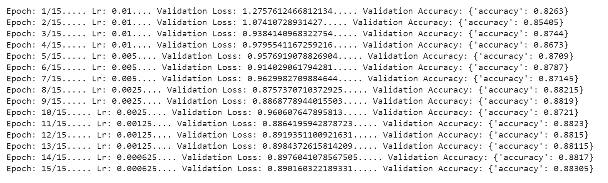
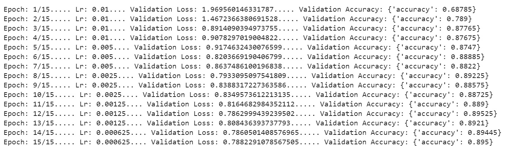

# Character-level-Convolutional-Networks-for-Text-Classification
NNFL Project

Contributors: 
- Ateeksha Mittal 2017A8PS0431P
- Dishita Malav 2017A7PS0164P
- Shefali Tripathi 2017A7PS0139P

*All notebooks uploaded have been written using Google's Colab. We would suggest to run them using the same.*

## Data Set

The datasets being used to train and test could not be uploaded due to the size being larger than 25 MB.
We have used two datasets:

### Our Dataset

Prepared by us, by cleaning the unclean AG News Corpus of around 2 million news samples obtained from http://groups.di.unipi.it/~gulli/AG_corpus_of_news_articles.html. 

**Dataset Link**: https://drive.google.com/drive/folders/1nUPhyFj164LnRKECFOcw8cpoIDShlqdP?usp=sharing

### Author's Dataset

Prepared by one of the authors of the paper "Character-level Convolutional Networks for Text Classification", Xiang Zhang.
We obtained this dataset from his personal website: http://xzh.me/

**Dataset Link**: https://drive.google.com/drive/folders/1vZ1agGTdHJDX455Vnl7Y1TW9eXqhUhWx?usp=sharing

*Note: Please open using your BITS email ID.*

## Colab Notebooks

### Cleaning.ipynb
### CharCNN.ipynb
### WordCNN.ipynb

## Results and Inference

### CharCNN
**Author's Dataset**
- Small Feature
  1. Training Results:  
  2. Validation Loss Graph:
  3. Confusion Matrix:
  4. Test Results:
- Large Feature
  1. Training Results:
  2. Validation Loss Graph:
  3. Confusion Matrix:
  4. Test Results:
  
**Our Dataset**
- Small Feature
  1. Training Results:
  2. Validation Loss Graph:
  3. Confusion Matrix:
  4. Test Results:
- Large Feature
  1. Training Results:
  2. Validation Loss Graph:
  3. Confusion Matrix:
  4. Test Results:
 
### WordCNN
**Author's Dataset**
- Small Feature
  1. Training Results:
  
  
  
  2. Validation Loss Graph:
  
  
  
  3. Confusion Matrix:
  
  	
  
  4. Test Results:
  
  	
  
- Large Feature
  1. Training Results:
  
  
  
  2. Validation Loss Graph:
  
  
  
  3. Confusion Matrix:
  
  	
  
  4. Test Results:
  
  
  
**Our Dataset**
- Small Feature
  1. Training Results:
  
  
  
  2. Validation Loss Graph:
  
  
  
  3. Confusion Matrix:
  
  	
  
  4. Test Results:
  
  	
  
- Large Feature
  1. Training Results:
  
  
  
  2. Validation Loss Graph:
  
  
  
  3. Confusion Matrix:
  
  	
  
  4. Test Results:
  
  
  
