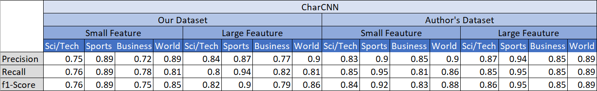
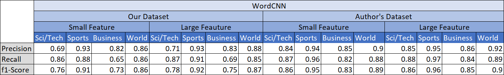
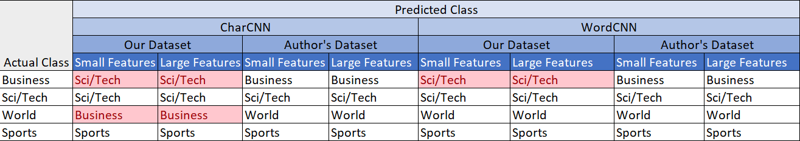
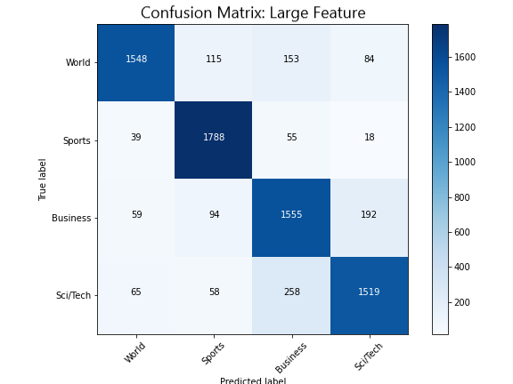
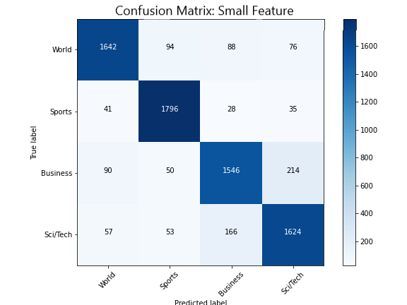
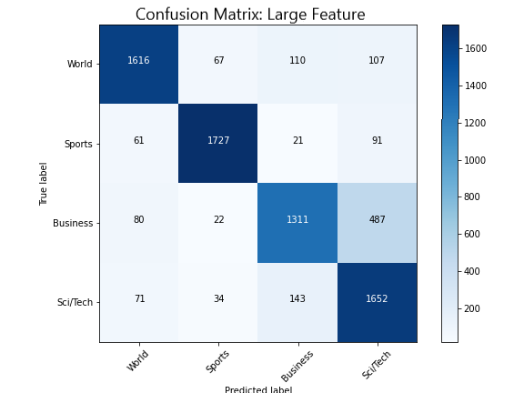
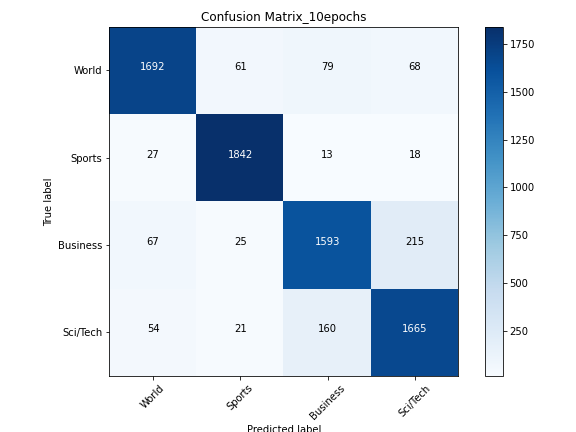

# Character-level-Convolutional-Networks-for-Text-Classification
NNFL Project

Contributors: 
- Ateeksha Mittal 2017A8PS0431P
- Dishita Malav 2017A7PS0164P
- Shefali Tripathi 2017A7PS0139P

*All notebooks uploaded have been written using Google's Colab. We would suggest to run them using the same.*

## Data Set

The datasets being used to train and test could not be uploaded due to the size being larger than 25 MB.
We have used two datasets:

### Our Dataset

Prepared by us, by cleaning the unclean AG News Corpus of around 2 million news samples obtained from http://groups.di.unipi.it/~gulli/AG_corpus_of_news_articles.html. 

**Dataset Link**: https://drive.google.com/drive/folders/1nUPhyFj164LnRKECFOcw8cpoIDShlqdP?usp=sharing

### Author's Dataset

Prepared by one of the authors of the paper "Character-level Convolutional Networks for Text Classification", Xiang Zhang.
We obtained this dataset from his personal website: http://xzh.me/

**Dataset Link**: https://drive.google.com/drive/folders/1vZ1agGTdHJDX455Vnl7Y1TW9eXqhUhWx?usp=sharing

*Note: Please open using your BITS email ID.*

## Colab Notebooks

### Cleaning.ipynb
The notebook contains the code used to clean the AG News Corpus. Running this notebook results in the clean csv files being saved into drive folder, whose link we have provided. *(We have already provided the cleaned files in said folder for ease)*
### CharCNN.ipynb
This Notbook
### WordCNN.ipynb

## Results and Inference
### Test Accuracy And Other Measures

### Random Prediction on News Samples

### Confusion Matrix
#### CharCNN
- Our Dataset

  
  

- Author's Dataset

  
  

#### WordCNN
- Our Dataset

  
  

- Author's Dataset

  
  

