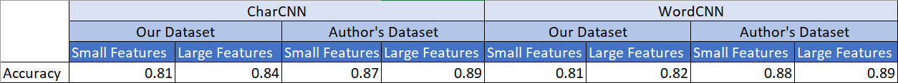

# Character-level-Convolutional-Networks-for-Text-Classification
**NNFL Project: Paper ID: 113**

Contributors: 
- Ateeksha Mittal 2017A8PS0431P
- Dishita Malav 2017A7PS0164P
- Shefali Tripathi 2017A7PS0139P

**[Presentation](Presentation.pdf)**

*All notebooks uploaded have been written using Google's Colab. We would suggest to run them using the same.*

## Problem Statement

- Implement Character-level Convolutional Network for Text Classification on the AG News dataset using PyTorch.
- Compare the results obtained with that of   Word-Based Convolutional Network for Text Classification on the same dataset. 
- [Papers](Papers)

## Data Set

The datasets being used to train and test could not be uploaded due to the size being larger than 25 MB.
We have used two datasets:

### Our Dataset

Prepared by us, by cleaning the unclean AG News Corpus of around 2 million news samples obtained from http://groups.di.unipi.it/~gulli/AG_corpus_of_news_articles.html. 

**Dataset Link**: https://drive.google.com/drive/folders/1nUPhyFj164LnRKECFOcw8cpoIDShlqdP?usp=sharing

### Author's Dataset

Prepared by one of the authors of the paper "Character-level Convolutional Networks for Text Classification", Xiang Zhang.
We obtained this dataset from his personal website: http://xzh.me/

**Dataset Link**: https://drive.google.com/drive/folders/1vZ1agGTdHJDX455Vnl7Y1TW9eXqhUhWx?usp=sharing

### Embedding

Pre-trained embedding.

**Dataset Link**: https://drive.google.com/file/d/1jsieNbVR1h1o_bSuYMZvFMeUjFy1xiMa/view?usp=sharing

*Note: Please open using your BITS email ID.*

## Network

## Colab Notebooks

### Cleaning.ipynb
The notebook contains the code used to clean the AG News Corpus. Running this notebook results in the clean csv files being saved into drive folder, whose link we have provided. *(We have already provided the cleaned files in said folder for ease)*
### CharCNN.ipynb
This notebook contains the implementation of Character-Based Convolutional Networks used to classify news samples from the AG News Corpus. 
### WordCNN.ipynb
This notebook contains the implementation of Word-Based Convolutional Networks used to classify news samples from the AG News Corpus. 
## Results and Inference
### Test Accuracy And Other Measures

### Confusion Matrix
#### CharCNN
- Our Dataset

  
  

- Author's Dataset

  
  

#### WordCNN
- Our Dataset

  
  

- Author's Dataset

  
  

### Random Prediction on News Samples

### Inference

- The models when run on the Author’s Dataset, predicts the classes of the random news samples correctly, on both large as well as small feature.
- On our Dataset, the models don’t perform as well, which makes sense when we compare the test accuracy achieved on both the datasets.

*[Other Results](Results)*

## Setup and Execution

1. Download the notebooks, Cleaning.ipynb, CharCNN.ipynb and WordCNN.ipynb., further, upload them onto your drive.
2. Open the Notebooks with Google's Colab.
3. Download the [Pre-Trained Word Embeddings](https://drive.google.com/file/d/1jsieNbVR1h1o_bSuYMZvFMeUjFy1xiMa/view?usp=sharing), upload it directly on your Google Drive.
4. Create shortcuts of the [Author's Dataset](https://drive.google.com/drive/folders/1vZ1agGTdHJDX455Vnl7Y1TW9eXqhUhWx?usp=sharing) and [Our Dataset](https://drive.google.com/drive/folders/1nUPhyFj164LnRKECFOcw8cpoIDShlqdP?usp=sharing) in your Drive.
5. You may run Cleaning.ipynb. (Not required, since we've already done that)
6. You can run CharCNN.ipynb and WordCNN.ipynb on either our dataset or the author's dataset *(While mounting the drive, please uncomment the path of the dataset you wish to use and comment the other)* using the small features or large feature *(While instantiating the model, please uncomment the function call you wish to use and comment the other)*
7. Run the notebooks by clicking on Runtime >> Run All.

***Please open all the DataSet links provided using your BITS email ID.***
